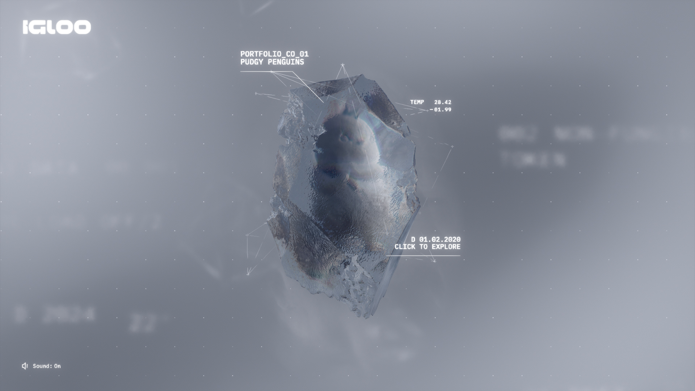

# Attention Is All You Need — A Reading Note

A few months ago I finally sat down and read the original Transformer paper properly, not just the blog post summaries. These are my notes.

---

## Background

Before Transformers, sequence modelling was dominated by RNNs and LSTMs. They worked, but they had two fundamental problems:

- Sequential computation meant you couldn't parallelise across time steps
- Long-range dependencies were hard — gradients vanish or explode over long sequences

CNNs were used as a partial fix (WaveNet, ByteNet) but required many layers to capture long-range context.

## The Core Idea

The Transformer ditches recurrence entirely. Everything runs on **self-attention**, which computes relationships between all positions in a sequence simultaneously.

Given queries $Q$, keys $K$, and values $V$, the attention output is:

$$\text{Attention}(Q, K, V) = \text{softmax}\left(\frac{QK^T}{\sqrt{d_k}}\right)V$$

The $\sqrt{d_k}$ scaling matters — without it, the dot products grow large in magnitude and push softmax into regions with tiny gradients.

## Architecture Overview

The full model stacks $N = 6$ encoder and decoder layers. Each encoder layer has two sublayers: multi-head self-attention and a position-wise feed-forward network. Residual connections wrap both, followed by layer norm:

$$\text{LayerNorm}(x + \text{Sublayer}(x))$$

## Multi-Head Attention

Rather than computing a single attention function, you run $h$ attention heads in parallel over learned projections, then concatenate:

$$\text{MultiHead}(Q, K, V) = \text{Concat}(\text{head}_1, \ldots, \text{head}_h)\, W^O$$

where $\text{head}_i = \text{Attention}(QW_i^Q, KW_i^K, VW_i^V)$.

Each head can attend to different parts of the representation. In the paper they use $h = 8$ heads with $d_k = d_v = d_{model}/h = 64$.

## Positional Encoding

Since there's no recurrence, position information has to be injected explicitly. The paper uses fixed sinusoidal encodings:

$$PE_{(pos,\, 2i)} = \sin\!\left(\frac{pos}{10000^{2i/d_{model}}}\right)$$

$$PE_{(pos,\, 2i+1)} = \cos\!\left(\frac{pos}{10000^{2i/d_{model}}}\right)$$

The choice of sinusoids is elegant — the model can attend to relative positions because $PE_{pos+k}$ is a linear function of $PE_{pos}$.

## What Surprised Me

A few things I didn't fully appreciate from summaries:

**The feed-forward layers are huge.** Each position runs through a two-layer MLP with inner dimension $d_{ff} = 2048$ vs $d_{model} = 512$. That's a 4× expansion. Most parameters live here, not in attention.

**Label smoothing hurts perplexity but helps BLEU.** The paper explicitly notes this — the model becomes less confident but generalises better. It's a nice example of optimising for the wrong metric at training time on purpose.

**The base model trained in 12 hours on 8 P100s.** By today's standards that's nothing. It's a reminder that the architecture's efficiency was a genuine contribution, not just the accuracy numbers.

## Complexity Comparison

| Layer Type | Complexity per layer | Sequential ops | Max path length |
|---|---|---|---|
| Self-attention | $O(n^2 \cdot d)$ | $O(1)$ | $O(1)$ |
| Recurrent | $O(n \cdot d^2)$ | $O(n)$ | $O(n)$ |
| Convolutional | $O(k \cdot n \cdot d^2)$ | $O(1)$ | $O(\log_k n)$ |

The quadratic cost in sequence length $n$ is the well-known scaling problem that later work (sparse attention, linear attention, etc.) tried to fix.

## Open Questions

I'm still thinking about:

- Why do learned positional embeddings perform about the same as sinusoidal? Is the inductive bias just not that important at these scales?
- The paper shows attention heads specialising, but how stable is this across runs?
- How much of the gain is attention vs just having residual connections and layer norm done right?

> "We conjecture that for large values of $d_k$, the dot products grow large in magnitude, pushing the softmax function into regions where it has extremely small gradients."

---

That's it for now. Next up I want to read the BERT paper and see how masked language modelling changes the picture.